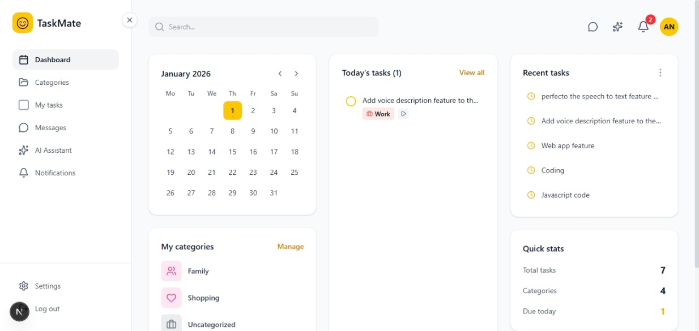

# TaskMate - Modern Task Management System

TaskMate is a comprehensive, production-ready task management application built with Next.js 16. It features real-time updates, AI-powered assistance, and a focus on visual excellence.



## ✨ Features

- **Dashboard**: High-level overview of your daily tasks, upcoming deadlines, and category-based stats.
- **Categorization**: Organize tasks with custom colors and icons.
- **Real-time Synchronization**: Powered by Ably for instant updates across devices.
- **AI Assistant**: Integration with Groq for smart task suggestions and productivity advice.
- **Notifications**: Automated reminders for due and overdue tasks.
- **Rich Text Editing**: Integrated Tiptap editor for detailed task descriptions.
- **Authentication**: Secure JWT-based authentication with email verification and password reset flows.

## 🚀 Tech Stack

- **Framework**: Next.js 16 (App Router)
- **Database**: MongoDB with Mongoose
- **Styling**: Vanilla CSS (Tailwind CSS for some utilities)
- **Real-time**: Ably
- **AI**: Groq SDK
- **Editor**: Tiptap
- **Icons**: Lucide React

## 🛠️ Getting Started

### Prerequisites

- Node.js 18+ 
- MongoDB instance (local or Atlas)
- Ably API Key
- Groq API Key

### Installation

1. Clone the repository:
   ```bash
   git clone https://github.com/yourusername/task-mate.git
   cd task-mate
   ```

2. Install dependencies:
   ```bash
   npm install
   ```

3. Set up environment variables:
   Copy `.env.example` to `.env.local` and fill in your credentials.
   ```bash
   cp .env.example .env.local
   ```

4. Run the development server:
   ```bash
   npm run dev
   ```

Open [http://localhost:3000](http://localhost:3000) with your browser to see the result.

## 🤝 Contributing & Collaboration

This project is **open for collaborations!** Whether you want to fix a bug, suggest a feature, or improve documentation, we welcome all contributors.

1. Fork the Project
2. Create your Feature Branch (`git checkout -b feature/AmazingFeature`)
3. Commit your Changes (`git commit -m 'Add some AmazingFeature'`)
4. Push to the Branch (`git push origin feature/AmazingFeature`)
5. Open a Pull Request

## 📜 License

Distributed under the MIT License. See `LICENSE` for more information.

## 🔧 Troubleshooting

- **MongoDB Errors**: If you encounter `Invalid namespace specified`, ensure your `MONGODB_URI` does not contain invalid characters or spaces in the database name.
- **Email Sending**: If emails are not being sent, check that your SMTP credentials are correctly configured in `.env.local`.

---
Built by Anila Nawaz.
